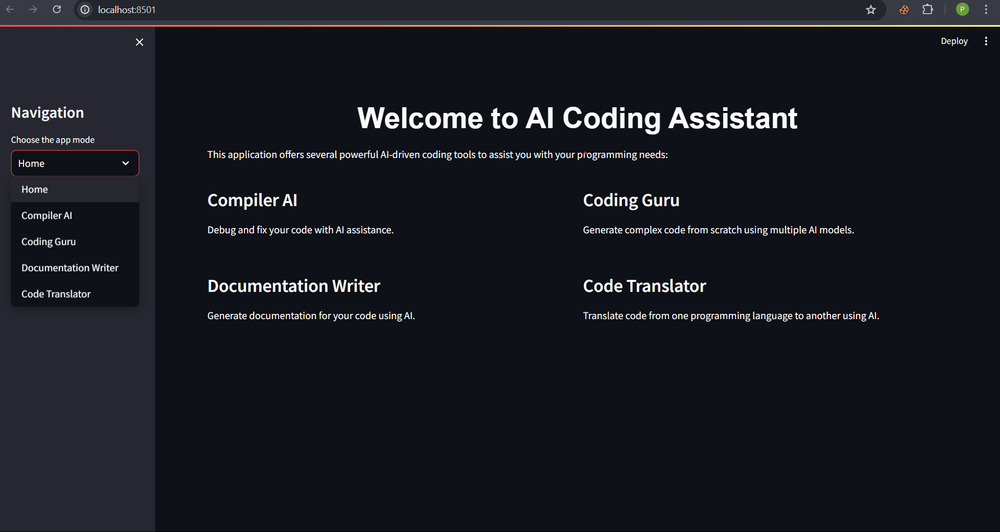

# AI COMPILER

>AI Compiler is a powerful tool that leverages multiple AI models to assist with various coding tasks, including code debugging, documentation generation, and language translation.

## Features

- Compiler AI: Debug and fix code with AI assistance
- Coding Guru: Generate complex code from scratch using multiple AI models
- Documentation Writer: Automatically generate code documentation
- Code Translator: Translate code between different programming languages
- Mixture of Agents : This MOA  Architechture can harness the collective strengths of multiple LLMs
## Preview :




## Installation

1. Clone the repository:
 ```bash
    git clone https://github.com/yourusername/ai-compiler.git
 ```
2. Change the Current Directory To ai-compiler:
 ``` bash
cd ai-compiler
 ```
3. Install required packages:
 ```bash
pip install -r requirements.txt
 ```
4. Set up API keys:
- Create a `.env` file in the project root
- Add the following lines, replacing `your_api_key` with actual keys:
  ```
  GROQ_API_KEY=your_api_key
  GENAI_API_KEY=your_api_key
  MIXTRAL_API_KEY=your_api_key
  ```
 Groq_API_KEY from: https://console.groq.com/keys

 GENAI_API_KEY from: https://console.groq.com/keys

 Mixtral_API_KEY from: https://build.nvidia.com/explore/discover#mistral-large

5. Run the application:
 ```bash
streamlit run ai_compiler.py
 ```

## Example Use Cases

- Debugging complex Python scripts
- Generating boilerplate code for new projects
- Creating documentation for legacy codebases
- Generating Complex code from scratch
- Translating code snippets between languages
- Learning coding patterns through AI-generated examples

## Contributing

Contributions are welcome! Please feel free to submit issues and pull requests.
